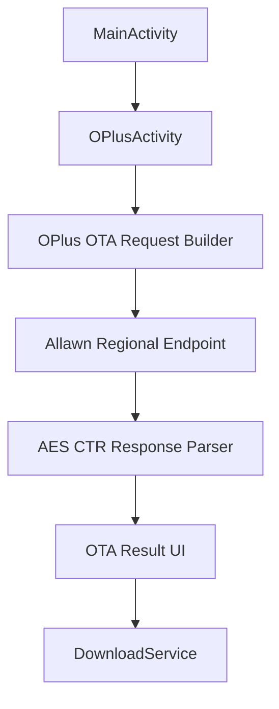

# OPlus OTA Tracker Integration

Feature Name: oplus-ota-tracker
Updated: 2026-09-08

## Description

新增独立 OPlus OTA 查询页，覆盖 OPPO、一加和真我设备。查询页使用 OPlus-Tracker 公开项目记录的 Allawn OTA 协议，按地区选择服务域名、语言、运营商和 RSA 公钥，查询结果复用现有下载服务。
查询页提供通用地区通道，按顺序尝试全部公开地区配置，并在每个成功结果中展示命中的地区。

## Architecture

## Components and Interfaces

- `OPlusActivity`: 地区、设备代号、查询和结果展示。
- `OPlusCrypto`: RSA-OAEP 公钥封装、AES-CTR 加解密和随机请求材料生成。
- `OPlusActivity.queryOta`: 组装地区请求头与加密请求体，调用 `/update/v3`。
- `DownloadService`: 接收动态下载链接并执行现有 Java Range 下载。

## Data Models

- `RegionConfig`: `code`、中文名称、服务域名、语言、carrier ID、公钥版本。
- `OtaComponent`: 名称、版本、下载链接、大小、MD5。
- `OtaResult`: 匹配地区、版本、OTA 版本、发布时间、安全补丁、更新说明、组件列表。

## Correctness Properties

- 查询请求的地区配置、语言、carrier ID 和公钥版本来自同一个地区代码。
- 请求 AES 密钥和 IV 只用于对应请求的加密和解密。
- 每个可下载组件使用其自身的下载链接、文件名和元数据。
- 通用地区查询结果包含实际命中的地区标签。
- 下载动作调用现有 `DownloadService`，保持现有暂停、继续、取消和断点能力。

## Error Handling

- 网络超时显示查询连接失败。
- 非 200 响应显示服务返回码和可读状态。
- 加解密或 JSON 解析失败显示响应解析失败。
- 缺少有效下载链接的组件显示不可下载状态。

## Test Strategy

- 编译验证 RSA/AES Android 实现和 UI 接线。
- 使用静态检查确认 19 个地区代码完整存在，地区列表与上游 `OTA_REGION_CONFIG` 保持一致。
- 手工使用一个真实设备代号分别查询 `cn` 和 `eu`，验证结果字段和下载按钮。
- 使用未知地区设备代号选择通用地区，验证成功结果显示命中的地区标签。
- 手工点击下载，确认任务进入现有下载卡片并保存到 DsuManager 目录。

## References

- [OPlus-Tracker](https://github.com/JerryTse-OSS/OPlus-Tracker)
- [OPlus-Tracker LICENSE](https://github.com/JerryTse-OSS/OPlus-Tracker/blob/main/LICENSE)
